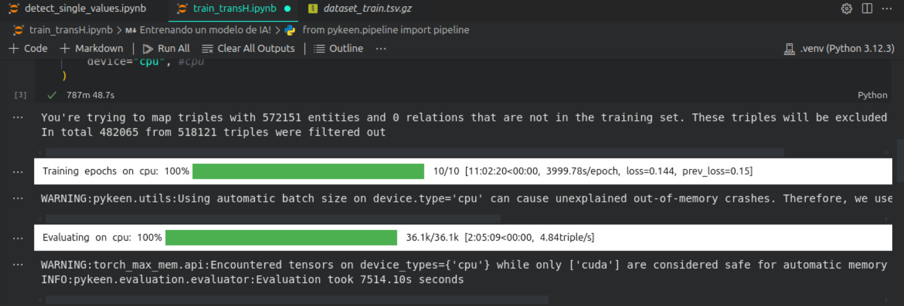

# ADR005: Diseño del Servicio de Redes Neuronales

## Contexto

En el proyecto **GraphSimilarity**, se requiere evaluar similitudes entre entidades dentro de un grafo. Este proceso es computacionalmente intensivo y depende de un modelo de red neuronal previamente entrenado para realizar estas evaluaciones de manera eficiente y precisa.

El servicio de redes neuronales, denominado **Neural Service**, se encarga de procesar las solicitudes y devolver las probabilidades de similitud entre entidades o identificadores proporcionados como input.

## Decisión

Se ha decidido implementar un microservicio dedicado a manejar la lógica de predicción del modelo de red neuronal previamente entrenado. Este servicio realizará las siguientes funciones:

1. **Carga del modelo**: Inicializar el modelo entrenado al iniciar el servicio.
2. **Procesamiento de solicitudes**: Evaluar las similitudes entre entidades en el grafo con base en los inputs proporcionados.
3. **Integración con la caché**: Colaborar con el servicio de caché para evitar cálculos redundantes.

## Detalles de Implementación

### Entrenamiento del Modelo

El modelo de red neuronal utilizado es TransH, entrenado con el siguiente fragmento de código:

```python
pipeline_result = pipeline(
    training='dataset/dataset_train.tsv.gz',
    testing='dataset/dataset_validation.tsv.gz',
    model="TransH",
    # Configuración de entrenamiento
    training_kwargs=dict(
        num_epochs=100,
        use_tqdm_batch=False,
    ),
    # Configuración de tiempo de ejecución
    random_seed=1234,
)
pipeline_result.save_to_directory(f'models')
```

- **Datos de entrenamiento**: Se utilizaron datasets comprimidos en formato TSV (`dataset_train.tsv.gz` y `dataset_validation.tsv.gz`) que contienen triples estructurados del grafo.
- **Modelo utilizado**: TransH, una técnica especializada en la representación de entidades y relaciones en grafos.
- **Configuración**: El modelo fue entrenado durante 100 épocas con una semilla aleatoria fija para garantizar reproducibilidad.
- **Exportación**: El modelo entrenado fue almacenado en el directorio `models` para ser cargado en el microservicio.
- **Duración del entrenamiento**: El proceso de entrenamiento del modelo tomó aproximadamente 13 horas.

La siguiente imagen muestra una captura de pantalla que detalla el tiempo requerido para el entrenamiento, realizado en una computadora sin tarjeta gráfica dedicada:



### Endpoints del Servicio

1. **Procesar URI**: Permite calcular la similitud de una entidad específica representada como una URI.
2. **Procesar ID**: Calcula la similitud para una entidad representada como un identificador numérico.
3. Ambos endpoints devuelven los 10 candidatos principales para la relación `sameAs` junto con sus scores.

### Carga del Modelo

El modelo es cargado desde el directorio `models` al iniciar el servicio, asegurando disponibilidad inmediata para procesar solicitudes.

## Justificación

La implementación de un microservicio dedicado para manejar el modelo de redes neuronales y el uso de TransH se justifican por los siguientes motivos:

1. **Separación de responsabilidades**: Mantener la lógica del modelo en un servicio dedicado facilita el mantenimiento, pruebas y escalabilidad.
2. **Precisión del modelo TransH**: Este modelo es ampliamente utilizado para representar relaciones y entidades en grafos, ofreciendo resultados precisos en problemas de similitud.
3. **Entrenamiento reproducible**: La configuración del entrenamiento permite replicar los resultados en diferentes entornos si es necesario.
4. **Eficiencia**: Al colaborar con el servicio de caché, se minimizan cálculos innecesarios y se optimiza el tiempo de respuesta.

## Consideraciones Futuras

1. **Actualización del modelo**: Implementar un pipeline automatizado para reentrenar y actualizar el modelo en función de nuevos datos.
2. **Optimización del modelo**: Explorar técnicas adicionales para mejorar el rendimiento y precisión del modelo, como ajustar hiperparámetros o probar arquitecturas avanzadas.
3. **Infraestructura escalable**: Considerar la implementación en entornos distribuidos para manejar un mayor volumen de solicitudes.
4. **Seguridad en el modelo**: Proteger los datos sensibles del modelo y su acceso mediante políticas de autorización estrictas.
