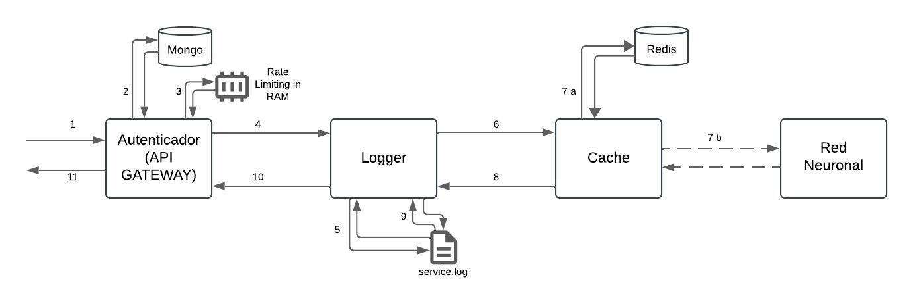

# Proyecto de Detección de Similitudes en Grafos de Conocimiento

Este proyecto consiste en el desarrollo de un servicio web (API) que expone un modelo de red neuronal para detectar similaridades en grafos de conocimiento. El objetivo es identificar si subgrafos hablan de la misma entidad, facilitando la eliminación de duplicados en grafos de conocimiento.

## Descripción del Proyecto

El servicio utiliza un modelo de red neuronal previamente entrenado que evalúa la similitud entre dos conjuntos de propiedades de subgrafos. Cada cliente de la plataforma debe autenticarse mediante una API Key, la cual se incluye en el encabezado HTTP `Authorization`. Las solicitudes al servicio son controladas de acuerdo con el tipo de cuenta del cliente, permitiendo hasta un máximo de solicitudes por minuto:

- **FREEMIUM**: 5 solicitudes por minuto.
- **PREMIUM**: 50 solicitudes por minuto.


### Requerimientos del Proyecto

El servicio debe cumplir con los siguientes requerimientos:

1. **Autenticación y Autorización**: Cada solicitud debe incluir una API Key en el encabezado `Authorization`. Las solicitudes sin una API Key válida deben ser rechazadas.
2. **Limitación de Solicitudes**: Según el tipo de suscripción del cliente, se limita la cantidad de solicitudes permitidas por minuto.
3. **Registro de Logs**: Cada solicitud debe ser registrada, incluyendo el tiempo total de procesamiento.
4. **Caché**: Se implementa un sistema de cache para datos de solo lectura y de baja volatilidad, con el fin de mejorar el rendimiento.
5. **Modelo de Redes Neuronales**: El microservicio de red neuronal debe procesar la similitud y devolver un resultado con la probabilidad de similitud entre los subgrafos.

### Respuesta del Servicio

Para una solicitud que evalúa la similitud de subgrafos, el resultado esperado es un JSON con la probabilidad de similitud. Ejemplo de respuesta:

```json
{
    "probabilidad": 0.7
}
```
### Aclaraciones técnicas

El sistema está compuesto por varios microservicios, donde el **Microservicio de Autenticación** actúa como la puerta de entrada al servicio. Este microservicio es responsable de la autenticación y autorización de los usuarios mediante una API Key. 

Para obtener más información sobre las definiciones de diseño de los microservicios en este proyecto, consulta el archivo [ADR001-microservice-style.md](./ADRs/ADR001-microservice-style.md). Este documento detalla las decisiones arquitectónicas tomadas y las razones detrás de ellas.

### Flujo de comunicación



1. El servicio de autenticación recibe la solicitud, verifica que el usuario esté autorizado y que el cuerpo de la solicitud cumpla con el formato esperado.
2. Se registra la solicitud de entrada en la base de datos a través del microservicio de logger.
3. La solicitud es derivada al microservicio de caché.
4. a. El microservicio de caché verifica si la solicitud ya está almacenada. Si es el caso, devuelve la respuesta directamente, evitando un nuevo cálculo por parte de la red neuronal.\n4. b. Si la información no fue procesada previamente o ha pasado demasiado tiempo desde el último cálculo, el microservicio de caché realiza una llamada a la red neuronal para recalcular la probabilidad.
5. La caché devuelve la respuesta al microservicio de logger.
6. Logger registra la respuesta final junto con el tiempo total de procesamiento.
7. Finalmente, el servicio de autenticación responde al cliente con los resultados.

### Aclaraciones de Logs

Los registros de la aplicación se almacenan en una base de datos MongoDB, configurada para operar en el puerto predeterminado (27017). Se recomienda utilizar Mongo Compass para visualizar la información de manera eficiente.


### Aclaraciones de Testing

## Registros de Aplicación (Logs)

Los registros de la aplicación se almacenan en una base de datos MongoDB configurada para operar en el puerto predeterminado (27017). Se recomienda utilizar Mongo Compass para explorar y analizar la información registrada de forma eficiente.

## Postman Collection

Se incluye una colección de Postman denominada `GraphSimilarity.postman_collection.json` para facilitar la realización de pruebas de forma rápida y eficiente.


## Configuración y Ejecución del Proyecto

## Requisitos Previos

- **Docker**: Necesario para ejecutar Redis y MongoDB en contenedores.
- **Docker-Compose**: Utilizado para orquestar el inicio de servicios y microservicios.
- **Python 3**: Requerido para la ejecución de los microservicios.
- **Librerías de Python**: Especificadas en el archivo `requirements.txt` en cada microservicio

### Estructura del Proyecto

```
project-root/
├── auth_service/
├── cache_service/
├── logger_service/
├── neural_service/
└── requirements.txt
```

### Usuarios Registrados

La plataforma no cuenta con un sistema de registro de usuarios. Sin embargo, existen usuarios predefinidos con credenciales y tipos de suscripción para pruebas:

- freemium_user: Usuario con cuenta FREEMIUM, contraseña password123.
- premium_user: Usuario con cuenta PREMIUM, contraseña password456.

Estos usuarios se pueden utilizar para obtener una API Key y realizar pruebas de acceso según el tipo de cuenta.

### Instrucciones para Levantar el Proyecto Utilizando Docker compose

Sigue estos pasos para levantar el proyecto utilizando Docker Compose:

1. **Construir las imágenes necesarias**  
   Ejecuta el siguiente comando para generar las imágenes necesarias para el proyecto:

   ```bash
   docker-compose build
   ```

2. **Iniciar los microservicios**
   Una vez generadas las imágenes, levanta todos los microservicios junto con sus dependencias ejecutando:
   
   ```bash
   docker-compose up
   ```
3. **Detener contenedores y eliminar imagenes**
   Si necesitas limpiar las imágenes creadas, ejecuta el siguiente comando:
  
  ```bash
   docker rmi auth_service_image logger_service_image cache_service_image neural_service_image
   ```

## Aclaraciones de Seguridad

- No se consideran aspectos de seguridad adicionales, como API Keys internas o redes privadas virtuales (VPC), ya que están fuera del alcance de este trabajo práctico.
- Tampoco se considerarán usuarios y contraseñas para las bases de datos MongoDB y Redis.